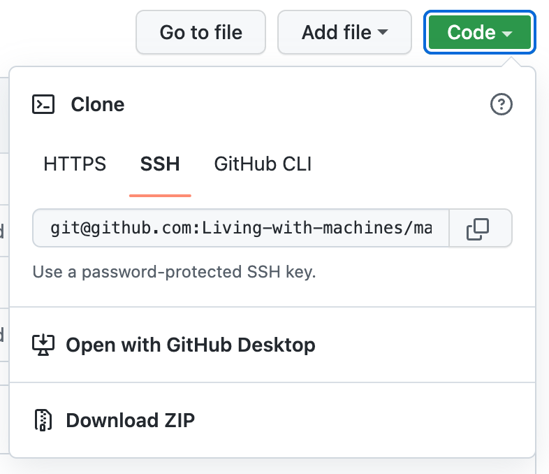

Built machines interactive
===============

This is the _built_ “machines interactive” for the _Living with Machines_ exhibit at Leeds City Museum 2022–23.

If you are looking for the development version, you will find it in the [`main` repository](https://github.com/Living-with-machines/machines-interactive/tree/main).

To run the kiosk using Python
---------------

### 1. Download the entire contents of this repository as a `.zip` file:

From the bottom of the "Code" menu on this page, select "Download ZIP":



### 2. Unzip the folder in your desired location

The automatic name for the unzipped folder is “machines-interactive-build”.

### 3. Serve the downloaded folder on your “localhost”

Using the following command in the parent folder to your downloaded repository, we will serve the content of the “machines interactive”:

```sh
$ python -m http.server 80 --directory machines-interactive-build
```

_Note: If you have changed the name of the downloaded folder, make sure you adjust the `machines-interactive-build` part above._

_Note: If you run into problem with a busy or blocked port, you can change the port (80) to any random number here._

### 3. Navigate to `http://localhost` (or `127.0.0.1`) in your browser.

_Note: If you changed the port above, you will need to follow “localhost” with `:PORT` for whichever port number you chose above._
